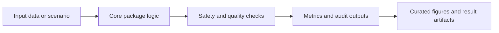

# DRAS-5

## Overview

Dynamic five-state risk assessment machine with constrained escalation and delayed de-escalation.

This repository is part of an eight-repository clinical decision-support research portfolio. Current status: manuscript or component package in preparation. The repository role is **manuscript and supplementary**.

## Standard Repository Layout

| Path | Purpose |
|---|---|
| `src/` | Package source code: `dras5` |
| `tests/` | Unit, smoke, and behavior checks |
| `scripts/` | Reproducibility and export scripts |
| `examples/` | Runnable examples and demonstrations |
| `figures/`, `visualizations/`, `outputs/`, `results/` | Generated visual and result artifacts |
| `data/`, `models/`, `evaluation/` | Dataset, model, and evaluation assets when used by this repo |
| `FIGURE_MANIFEST.csv` | Curated figure inventory for manuscript or component evidence |
| `pyproject.toml`, `setup.py`, `requirements.txt`, `pytest.ini` | Python package and test configuration |

## Architecture Flow



## Core Logic

- Map risk score to acuity state.
- Enforce monotonic escalation constraints.
- Apply C4 approval and C5 cooling-period rules.
- Export audit trail and simulation summaries.

## Key Formulas And Rules

- Effective risk: R_eff(t) = R_current + (R_peak - R_current) * exp(-lambda * delta_t)
- Monotonic safety: S(t+1) >= S(t) unless C5 de-escalation constraints hold
- C4 approval: de-escalate only if approval=true and sustained low risk

## Data, Results, Charts, And Graphs

The curated visual set is controlled by FIGURE_MANIFEST.csv and currently lists **6** figure entries. The manifest links figure IDs, roles, source scripts, source data, captions, sections, timestamps, and export DPI.

| ID | Role | PNG | PDF |
|---|---|---|---|
| DRAS5-F1 | manuscript | `figures\fig1_state_machine.png` | `figures\fig1_state_machine.pdf` |
| DRAS5-F2 | manuscript | `figures\fig2_pipeline.png` | `figures\fig2_pipeline.pdf` |
| DRAS5-F3 | manuscript | `figures\fig6_sensitivity.png` | `figures\fig6_sensitivity.pdf` |
| DRAS5-F4 | manuscript | `figures\fig10_performance.png` | `figures\fig10_performance.pdf` |

## Reproduce

Run these from the repository root (the directory containing this `README.md`):

```bash
python -m venv .venv
# Windows:        .\.venv\Scripts\Activate.ps1
# Linux / macOS:  source .venv/bin/activate
pip install -e .
python -m pytest -q

# Regenerate the quantitative safety metrics from the fixed seed (42).
# Writes results/*.csv and results/summary.json:
python scripts/run_all.py

# Redraw the data figures directly from results/*.csv:
python scripts/generate_figures.py
```

`scripts/run_all.py` is deterministic at seed 42, so a rerun reproduces the
committed `results/*.csv` byte-for-byte. The data figures (MER, OER, C5 outcomes)
are drawn from those CSVs, not from numbers hardcoded in the plotting script.

**Reproducibility status:** the structural **MER = 0%** guarantee (constraint C1)
reproduces; the over-escalation / C5 de-escalation figures do **not** reproduce from
the committed model. See [`REPRODUCIBILITY.md`](REPRODUCIBILITY.md) for the exact
manuscript-vs-code comparison and the verified root cause.

## Verification Criteria

- Root metadata and package files are present.
- Source paths follow `src/<package>/...` where the package shape allows it.
- Tests pass with `python -m pytest -q`.
- Curated figures are listed in `FIGURE_MANIFEST.csv` rather than inferred from every raw image file.
- Manuscript status wording stays conservative: in preparation, implementation, supplementary, or reproducibility/component evidence as appropriate.
- No local manuscript path, external assistant wording, or software metadata block is kept in the repository text.

## Portfolio Relationship

| Repository | Role |
|---|---|
| BASICS-CDSS | Beyond-accuracy evaluation methodology |
| TRI-X | Framework-level package |
| ORASR | Routing and safety-action component |
| DRAS-5 | Dynamic risk-state component |
| SAFE-Gate | Safety-gated ensemble framework |
| SynDX | Synthetic validation and explainability evidence |
| SURgul | SRGL/governance reproducibility component |
| TRI-X-CDSS | Integration and implementation package |
| Selective-CDSS | Risk-controlled selective-prediction (abstention) component |
| Causal-CDSS | Causal-inference evaluation component |
| Beyond-Accuracy | Simulation-based safety/calibration evaluation framework |

## Contact

**Chatchai Tritham**  
Department of Computer Science and Information Technology, Faculty of Science, Naresuan University, Phitsanulok 65000, Thailand  
Email: chatchait66@nu.ac.th  
ORCID: 0000-0001-7899-228X

**Chakkrit Snae Namahoot**  
Department of Computer Science and Information Technology, Faculty of Science, Naresuan University, Phitsanulok 65000, Thailand  
Email: chakkrits@nu.ac.th  
ORCID: 0000-0003-4660-4590